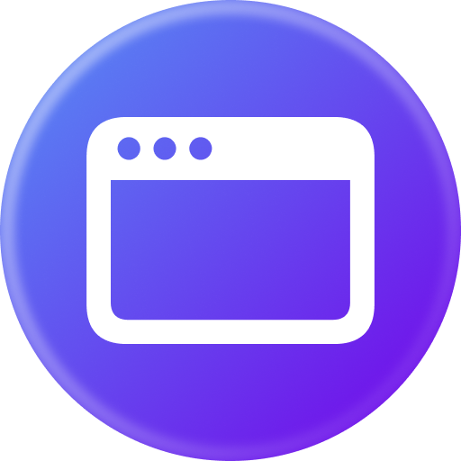

# Screeni - Beautiful Screenshot Generator

<div align="center">
  
  <p><strong>Create stunning screenshots with a powerful drag & drop editor. Export in any size, all in your browser.</strong></p>
</div>

## ✨ Features

### 🎨 Rich Editor
- **Drag & Drop Interface** - Intuitive element positioning with real-time feedback
- **Text Elements** - Fully customizable typography with multiple fonts, sizes, and weights
- **Image Support** - Upload images with automatic aspect ratio preservation
- **Shape Tools** - Add rectangles and circles with customizable styling
- **Layer Management** - Z-index control with bring-to-front/send-to-back

### 🎯 Smart Alignment
- **Auto-Snapping** - Elements snap to canvas center and other elements
- **Visual Guides** - Real-time alignment indicators
- **Quick Alignment Buttons** - Instantly align to edges or center
- **Toggle Snap** - Enable/disable snapping as needed

### 🌈 Beautiful Backgrounds
- **Gradient Library** - 10+ pre-designed gradients (Sunset, Ocean, Fire, etc.)
- **Custom Gradients** - Create linear or radial gradients with multiple colors
- **Solid Colors** - Full color picker support
- **Live Preview** - See changes in real-time

### 📐 Advanced Image Editing
- **Aspect Ratio Preservation** - Maintain proportions when resizing from corners
- **Free Resize** - Independent width/height adjustment from edges
- **Border Styling** - Customizable border width and color
- **Border Radius** - Round corners with pixel precision

### 📱 Pre-designed Templates
Ready-to-use templates for various platforms:
- **Social Media** - Instagram, Twitter, Facebook, LinkedIn posts
- **Marketing** - Product showcases, announcements, promotional content
- **Tech** - Professional banners and graphics
- All templates feature gradient backgrounds and professional layouts

### 🎯 Export Options
- **High Quality PNG** - Export at 2x or 3x resolution
- **Custom Canvas Sizes** - 15+ presets including social media, HD, 4K
- **Auto-Scaling** - Canvas automatically fits viewport
- **Responsive** - Works on any screen size

### 🌙 Dark Mode
- Modern dark UI throughout the entire application
- Optimized for extended editing sessions

## 🚀 Getting Started

### Prerequisites
- Node.js 18+ and npm/yarn/pnpm

### Installation

1. **Clone the repository**
   ```bash
   git clone https://github.com/yourusername/screeni.git
   cd screeni
   ```

2. **Install dependencies**
   ```bash
   npm install
   ```

3. **Start development server**
   ```bash
   npm run dev
   ```

4. **Open in browser**
   ```
   http://localhost:4321
   ```

## 🛠️ Tech Stack

- **[Astro](https://astro.build)** - Static site framework
- **[React](https://react.dev)** - UI components
- **[Tailwind CSS](https://tailwindcss.com)** - Styling
- **[Zustand](https://zustand-demo.pmnd.rs/)** - State management
- **[Radix UI](https://www.radix-ui.com/)** - Headless UI components
- **[Lucide React](https://lucide.dev)** - Icons
- **[html-to-image](https://github.com/bubkoo/html-to-image)** - PNG export

## 📦 Build

Build the project for production:

```bash
npm run build
```

Preview the production build locally:

```bash
npm run preview
```

## 🚀 Deployment

### Deploy to Cloudflare Pages

This project is optimized for Cloudflare Pages deployment:

1. **Login to Cloudflare**
   ```bash
   npx wrangler login
   ```

2. **Deploy**
   ```bash
   npm run deploy
   ```

Your site will be available at `https://screeni.pages.dev`

### Alternative Deployment Options

#### Vercel
```bash
npm install -g vercel
vercel
```

#### Netlify
```bash
npm install -g netlify-cli
netlify deploy --prod --dir=dist
```

#### GitHub Pages
Add to your repository settings and push the `dist` folder.

## 📖 Usage Guide

### Creating Your First Screenshot

1. **Choose a Template** - Start with a pre-designed template or blank canvas
2. **Customize Canvas** - Set size from presets or enter custom dimensions
3. **Add Elements**
   - Click "Text" to add text elements
   - Click "Image" to upload images
   - Click shapes to add rectangles or circles
4. **Style Elements** - Use the properties panel to customize colors, sizes, and more
5. **Arrange Elements** - Drag elements to position them, use alignment tools
6. **Export** - Click "Export PNG" to download your screenshot

### Keyboard Shortcuts

- **Delete** - Remove selected element
- **Ctrl/Cmd + Z** - Undo
- **Ctrl/Cmd + Shift + Z** - Redo

## 🤝 Contributing

Contributions are welcome! Please feel free to submit a Pull Request.

1. Fork the repository
2. Create your feature branch (`git checkout -b feature/AmazingFeature`)
3. Commit your changes (`git commit -m 'Add some AmazingFeature'`)
4. Push to the branch (`git push origin feature/AmazingFeature`)
5. Open a Pull Request

## 🐛 Bug Reports

If you find a bug, please create an issue with:
- Clear description of the problem
- Steps to reproduce
- Expected vs actual behavior
- Screenshots if applicable

## 💡 Feature Requests

Have an idea? Open an issue with the `enhancement` label and describe:
- The feature you'd like to see
- Why it would be useful
- Any implementation ideas

## 📝 License

This project is open source and available under the [MIT License](LICENSE).

## 🙏 Acknowledgments

- Built with [Astro](https://astro.build)
- UI components from [Radix UI](https://www.radix-ui.com/)
- Icons by [Lucide](https://lucide.dev)
- Inspired by modern design tools

## 📧 Contact

Project Link: [https://github.com/yourusername/screeni](https://github.com/yourusername/screeni)

---

<div align="center">
  <p>Made with ❤️ by the open source community</p>
  <p>⭐ Star this repo if you find it useful!</p>
</div>
